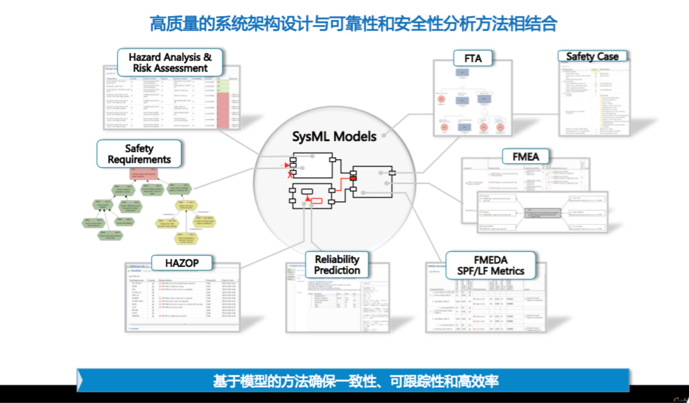
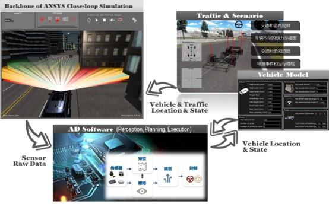

# Ansys 自动驾驶技术 Ansys Autonomy

## Ansys 自动驾驶解决方案目的

为短期内上市的自动驾驶公司提供数十英里的仿真测试环境，使得其算法可以短时间内满足必要的机器测试步骤且符合安全标准。

## Ansys 自动驾驶解决方案

Aysns 自动驾驶解决方案是将高保真物理学与真实驾驶和操纵场景的闭环仿真相结合，以验证功能的安全性。

### Ansys 功能

ANSYS高精度自动驾驶仿真验证平台提供了基于物理的三维场景建模、基于语义的道路事件建模、基于物理光学属性的摄像头和激光雷达的仿真、基于物理电磁学属性的毫米波雷达的仿真，从而实现多传感器、多交通对象、多场景、多环境的实时闭环仿真。主要功能如下：

* 开放式交通场景编辑模块，自定义设定道路和交通场景，可以自定义设定道路两旁的建筑物，绿化带等等；
* 可自定义设定道路场景上的交通流，如自定义设定道路上来往的车辆，行人和交通指示灯；
* 可自行设定自动驾驶车辆的车辆动力学参数；
* 支持高精度的三维场景仿真和基于环境光的模拟；
* 支持高精度的物理属性的传感器仿真，包括毫米波雷达的仿真、摄像头的仿真和激光雷达的仿真；
* 提供了开放的接口，可以与实物传感器、VR设备、控制器、各类测试数据进行无缝的联入，以满足不同级别、不同目标的测试仿真要求。

## Ansys Autonomy Safety & Cybersecurity Ansys自动驾驶安全和网络安全

* 自动驾驶安全

    * 传感器 Sensors：传感器仿真与验证

        仿真激光雷达、摄像头、雷达等各种类型的传感器，准确预测安装在车辆上的性能。

    * 软件 Software：推动自动化和控制软件开发。

        通过仿真并自动生成经过ISO 26262标准认证的代码，加快通过认证的时间（2倍），并将嵌入式软件开发成本降低50%。

    * Scenarios 场景：场景验证。 

        快速测试数百万种驾驶场景下的车辆，包括复杂的现实环境交通、行人、天气和光照条件等。

    * 系统 System：系统集成。 

        从芯片级到系统级仿真控制算法、人机交互（HMI）、车辆动力学等，确保车辆的可靠性与安全性。

* 网络安全：功能安全、SOTIF和网络安全分析。 

    在功能安全分析方面，开展危险与可操作性（HAZOP）分析、故障树分析（FTA）、故障模式与影响分析（FMEA）、故障模式、影响和诊断分析（FMEDA）；在网络安全分析方面，开展评估目标（TOE）建模、威胁评估和修复分析（TARA）以及攻击树分析。

## Ansys自动驾驶的闭环仿真

### Functional Safety & SOTIF Analysis 功能安全 & SOTIF 分析

通过实施关键的安全分析方法，如故障模式和影响分析(FMEA)，实现了功能安全分析的自动化，并将关键活动无缝地集成到整个产品开发中，确保自动驾驶基于模型方法的一致性、可跟踪性和高效率。
    
* 分析原则

    * FUSA ISO 26262
    * SOTIF Standard ISO 21448

* Causes Analysis 原因分析

    * Limitaions & Disturbances：利用车辆行为和触发条件构建Fault Trees，用于分析造成限制和干扰的原因。
    * Triggering Conditions：仿真测试中产生的信的问题，根据SOTIF原则创建信的触发条件

### Control Software Development 控制软件开放

分为 Autonomous Mode（develped by Embotech）和 Manual Mode

* Geofencing Controls：Autopilot 只允许在已知的地理区域内运行，可以设置路径决策，道路条件，速度，传感器条件等
* 控制软件需通过 ANSYS SCADE 进行判别和验证。自动驾驶系统是由神经网络实现的，而集成神经元网络不可避免会有出错概率，Ansys SCADE解决方案通过对所有代码生成活动进行数值建模和控制，使软件工程师能够满足行业安全标准并提供高水平的性能。
* Code 生成需通过 ASICD 评估

### Closed-Loop Simulation 闭环仿真

仿真器由SCANER提供支持

* 车辆动力学仿真添加到loop中
* 基于安全功能分析的场景可以由 AI mode 产生也可在 Scenario Library 中选择
* 场景变化量
        
    场景仿真目标：通过在真实世界模型， 仿真世界场景，传感器模型中对 perception，planning， control 算法进行测试，使其满足需求

* 传感器仿真

    * Semantic Sensor Models 语义传感器模型：验证控制算法
    * High Fidelity Physic-based sensor Models 高保真物理传感器模型：验证感知算法在不同环境，不同条件中的表现
    * Validate the full system

### Simulating everything in unison

* 系统，软件，动画演示，传感器都用于测试自动驾驶车辆
* 通过获取测试驾驶员的行为和接管的情况得到反馈，车辆可以通过数字，视觉，听觉的方式对驾驶员发出警告
* 在loop中引入人机交互，可以优化系统，使其使用更加快速，容易
* Monitor Situationed Awareness：紧急情况管理和用户接管情况
* Anticipate situaions：路口link之间对拓扑关系，使得自动驾驶车辆可以在loop中持续的跑
