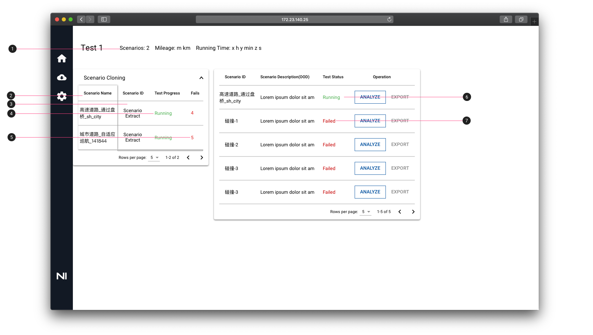
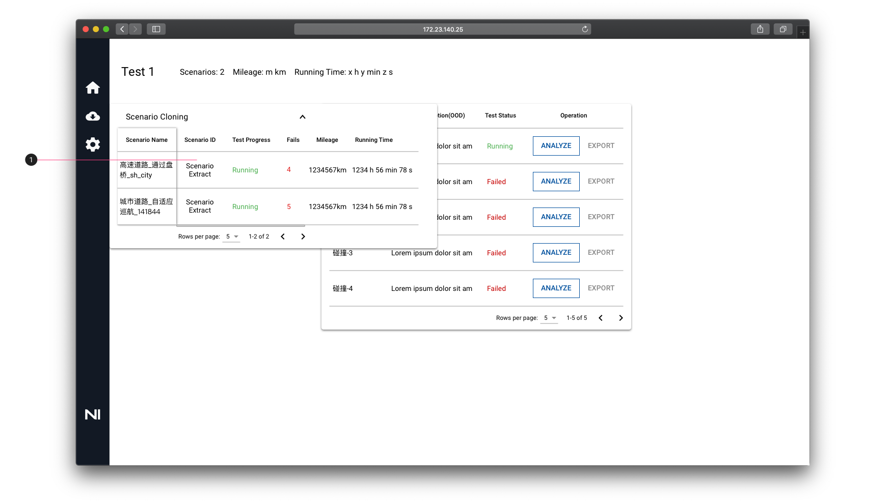

# Endurance Test Monitor 功能

1. 统计所有场景测试的总里程和运行时间
2. 表格第一列固定
3. 表格最大高度为 695px。当前仅有两条场景数据，且表格高度小于695px，表格高度随内容行数动态变化。
4. Test Process 状态均为 Running 状态，颜色为 #4CAF50
5. Fails数：Fails次数为当前场景发生的碰撞次数
6. 表格第一行：显示当前场景信息，Test Status 为 Running 状态
7. 表格下面没一行均为当前场景出现的碰撞场景信息，Test Status 均为 Failed 状态。

1. 表格展开全部内容：记录每个场景测试的里程和运行时间