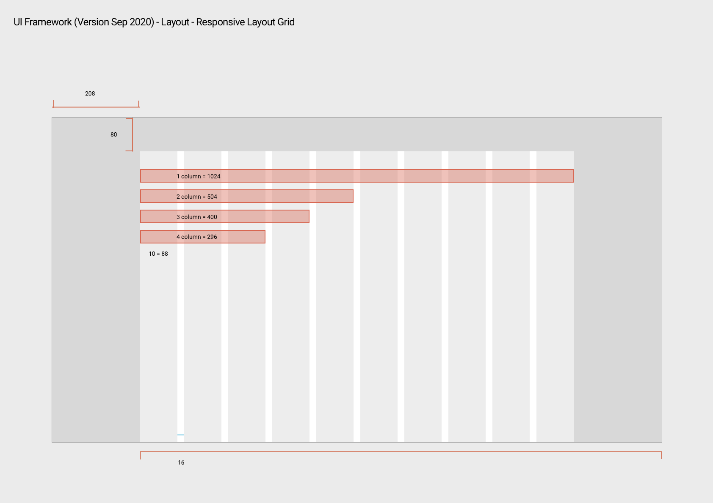

# UI Framework产品需求

## 页面布局

1. 页面居中显示内容宽为1024px
2. 两侧留白为208px（当页面宽幅为1440px时）
3. 两侧菜单栏宽均为192px，左侧显示一级标题，二级标题...，右侧菜单栏显示最末级标题下的子标题
4. 中间内容显示宽为608px，并与两侧菜单栏相距16px

## 布局内容

1. NI图标：64px*64px
2. NavInfo Simulation：Heading 5， 紧靠NI图标
3. UI Framwork2.0：Roboto  Regular 14px #979797
4. English: Body1, 翻译图标右侧紧靠English
5. 菜单一级标题：Roboto Medium 16px
6. 菜单二级标题：Body 2
7. 内容一级标题：Heading 4
8. 内容二级标题：Heading 5
9. 内容字体：Body 1
10. 目录一级标题：Body 1
11. 目录二级标题：Body 2 #6D7278

## 响应式布局

10 column（每个column 88px）， gutter（16px），margin（0）

## Typography

1. 点击图标，当前矩形框内容向下滑，显示代码内容
2. 文字两侧距矩形框16px，点击Heading显示详细信息

点击字体展示字体的详细内容，同时其他内容下滑

1. 字体详细信息，背景色为#F5F5F5
2. 字体：Roboto 14px Regular #B0B0B0
3. 字体：Roboto 14px Regular #000000

1. 点击其他型号字体，上次点击后显示的详细信息收起，同时显示当前点击字体型号的详细信息

## Color

1. Primary,Secondary: 字体Subtitle 2
2. 大写字母P，S：Roboto  Regular 24px #000000
3. 编号：字体 body 2
4. 颜色块：58px*58px