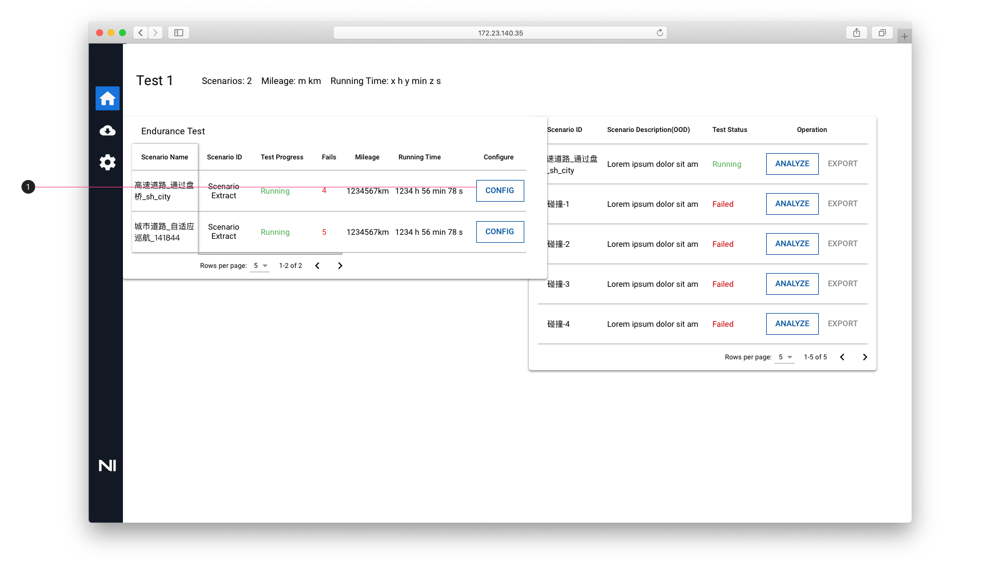
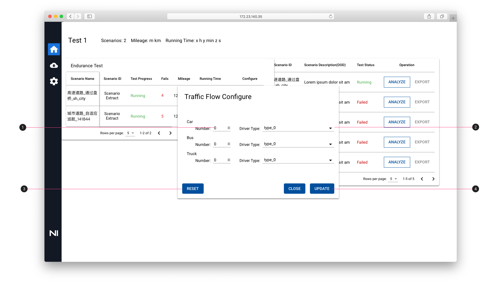
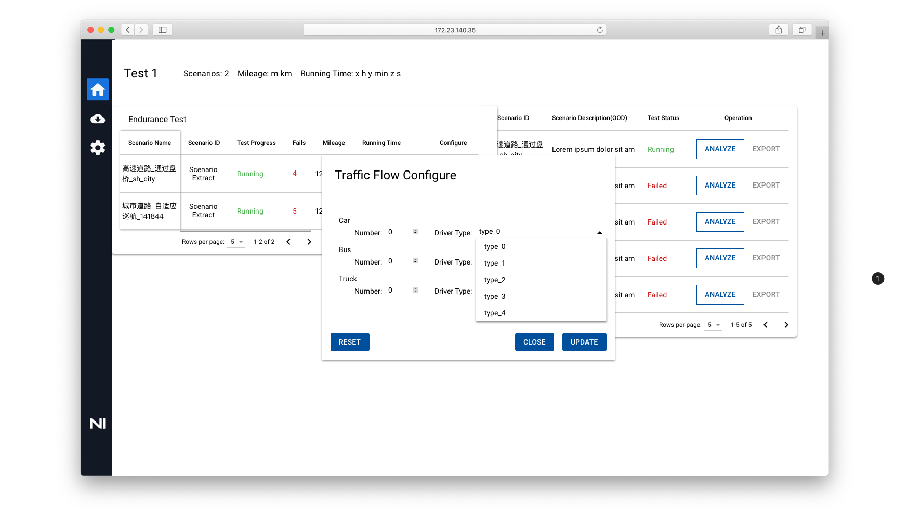

# Endurance Test — Monitor - Traffic Flow Configure 交通流配置

## 添加 Config 按钮

点击 Endurance Test 卡片中的 Monitor 按钮进入监控页面

1. 添加一列显示 Config 的配置按钮，用于配置交通流

## 交通流配置弹窗

点击 Config 按钮后，出现弹窗，显示交通流配置默认状态，车辆数量为0，驾驶员类型为type_0, 用户可根据其需求进行相关类型车辆的数量及驾驶员类型的交通流配置

1. Number：车辆数量设置，可通过输入数字，也可通过计步器的样式设置数量
2. Driver Type：通过下拉列表选择驾驶员类型
3. Reset：点击重置按钮，车辆数量，驾驶员类型恢复默认状态
4. Update：点击更新按钮，提交交通流配置，相关数据由前端发送给后段

## 驾驶员类型选择

1. Driver Type：点击下拉框，选择不同的驾驶员类型