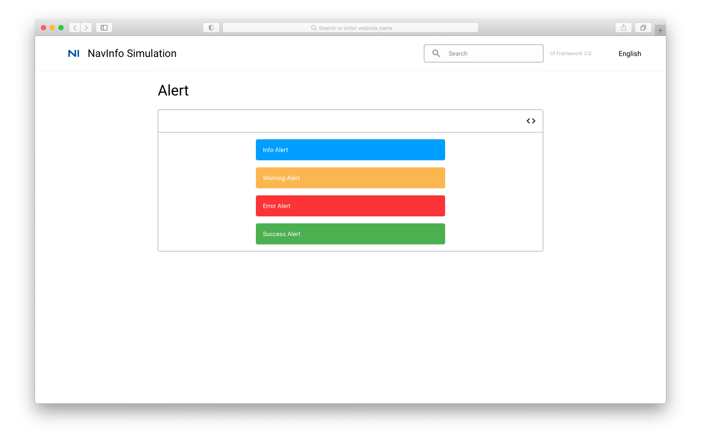
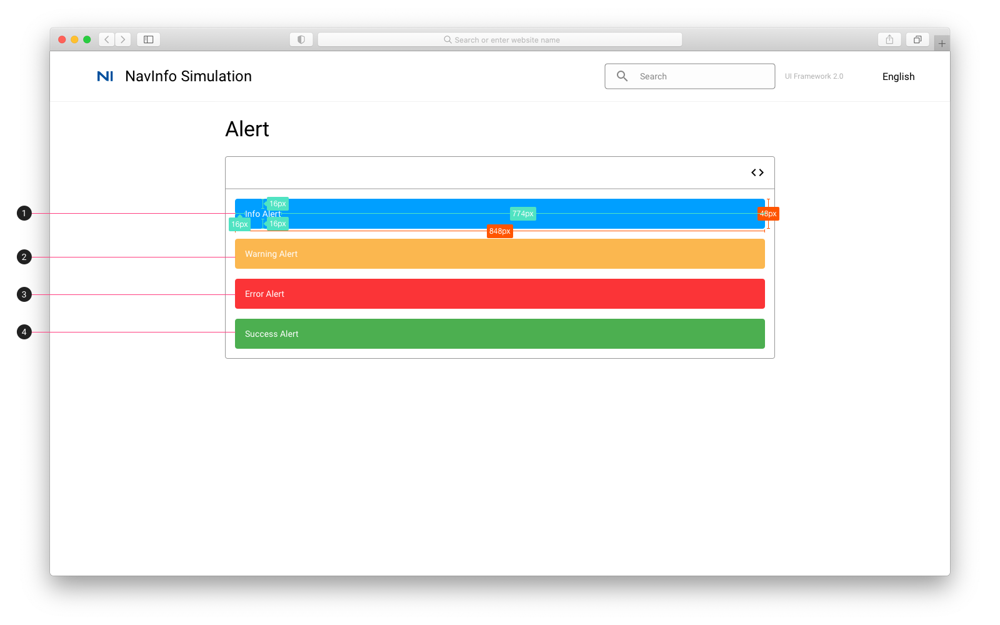

# Alert 提醒

## Alert

## Alert 标注

1. Information
    * 填充色：#009FFF； 
    * 字体：Body2 #FFFFFF
2. Warning
    * 填充色：#FBB74F；
    * 字体：Body2 #FFFFFF
3. Error
    * 填充色：#FB3437；
    * 字体：Body 2 #FFFFFF
4. Success
    * 填充色：#4CAF50；
    * 字体：Body 2 #FFFFFF

## 参考资料

* Vuetify: [Vuetify Alert](https://vuetifyjs.com/en/components/alerts/#type)