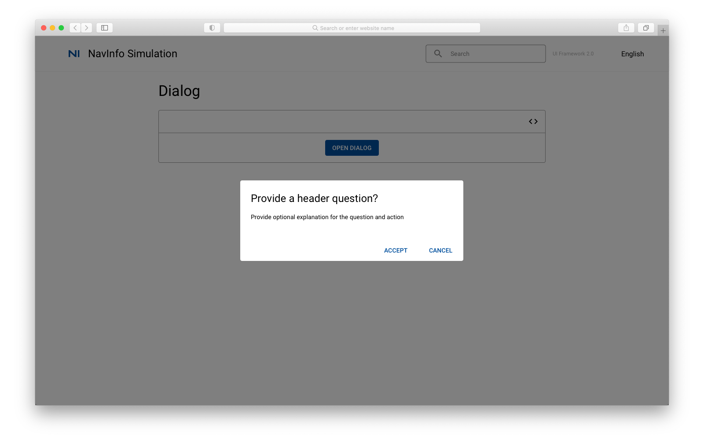
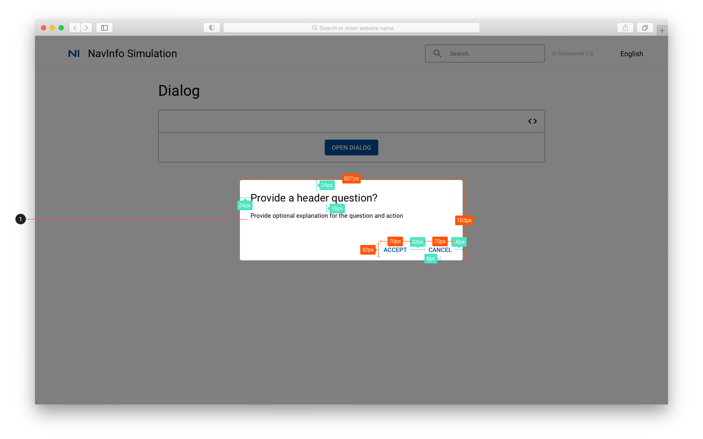

# Dialog 对话框

## Dialog

## Dialog

1. 点击open dialog 按钮弹出对话框
    * 标题字体：Heading 5
    * 正文字体：Body 2
    * 按钮字体：Button，颜色 #004F9D

## 参考资料

* Vuetify: [Vuetify Dialog](https://vuetifyjs.com/en/components/dialogs/)