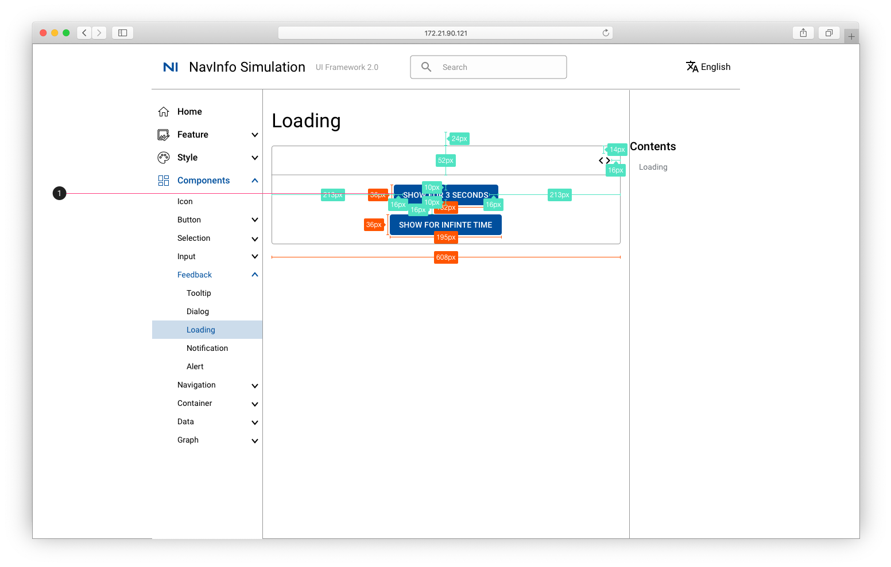
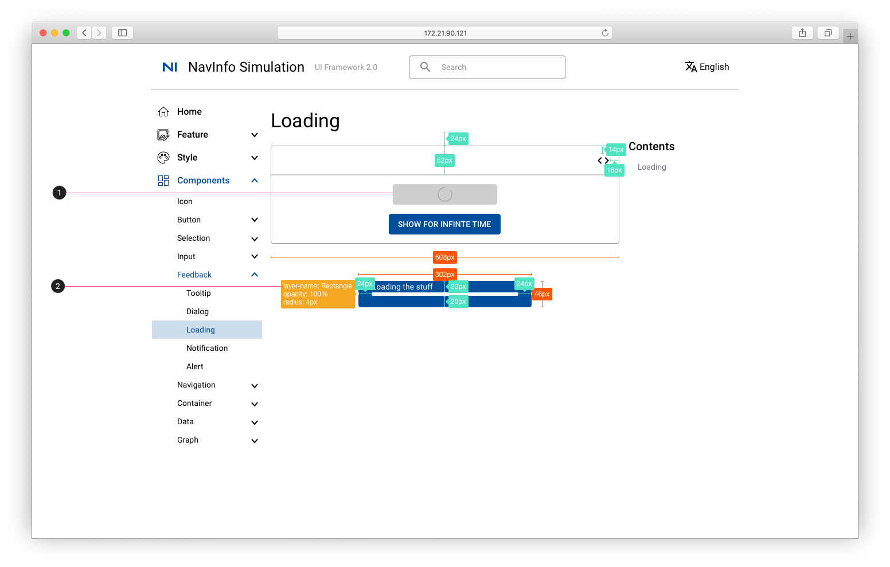
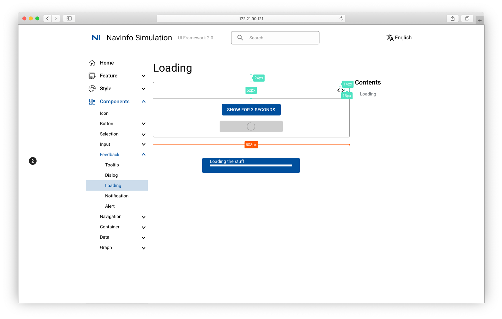

# Loading 加载

1. 填充色：primary color #004F9D； 字体：Button #FFFFFF

1. 原始按钮变灰，中心有加载符号转动
2. 进度条框位于页面中心，显示时间3s，填充色：primary color #004F9D； 字体：Button #FFFFFF

1. 进度条框位于页面中心，显示时间无限，填充色：primary color #004F9D； 字体：Button #FFFFFF