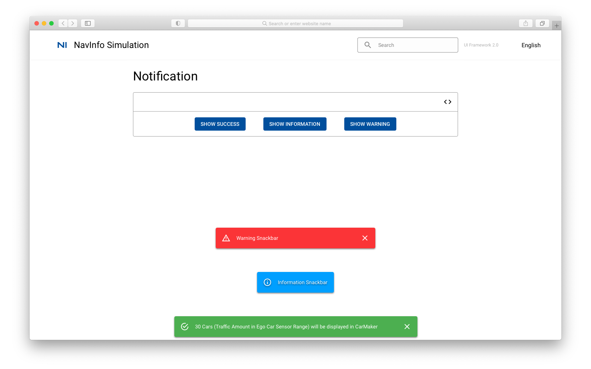
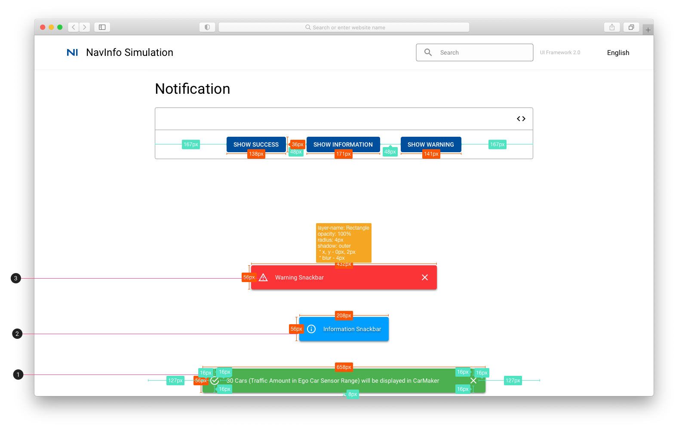

# Notification 通知

## Notification

## Notification 标注

1. 点击按钮通知栏显示在页面下部居中。 成功通知
    * 填充色：#4CAF50
    * 字体：Body 2 #FFFFFF
2. 信息通知
    * 填充色：#009FFF
    * 字体：Body 2 #FFFFFF
3. 警告通知
    * 填充色：#FB3437
    * 字体：Body 2 #FFFFFF
4. [成功](../../../icon_library/checkbox-marked-circle-outline.svg), [信息](../../../icon_library/information.svg)， [警告](../../../icon_library/alert-outline.svg)
