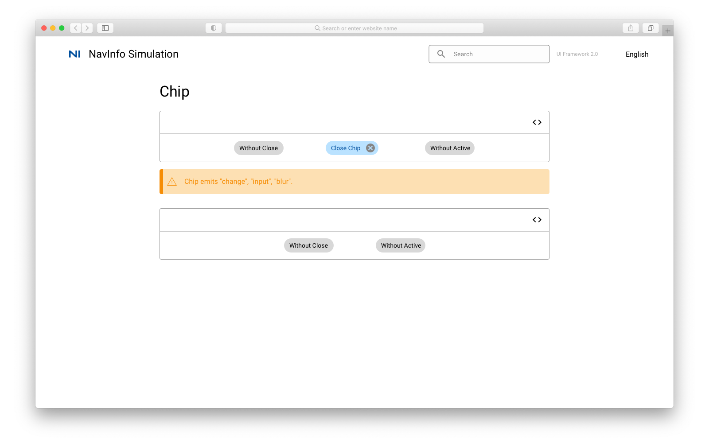
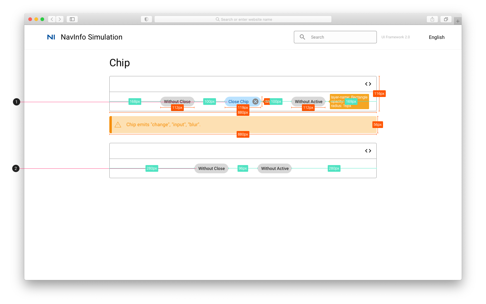

# Chip 纸片

## Chip

## Chip 标注

1. 可删去Chip
    * 圆角矩形颜色：#BAE2FF
    * 字体：Body 2 #004F9D
2. 不可删去Chip
    * 圆角矩形颜色：#868686
    * 字体：Body 2
    * 点击close按钮后，原chip消失，剩余chip居中

## 参考资料

* Vuetify: [Vuetify Chip](https://vuetifyjs.com/en/components/chips/)