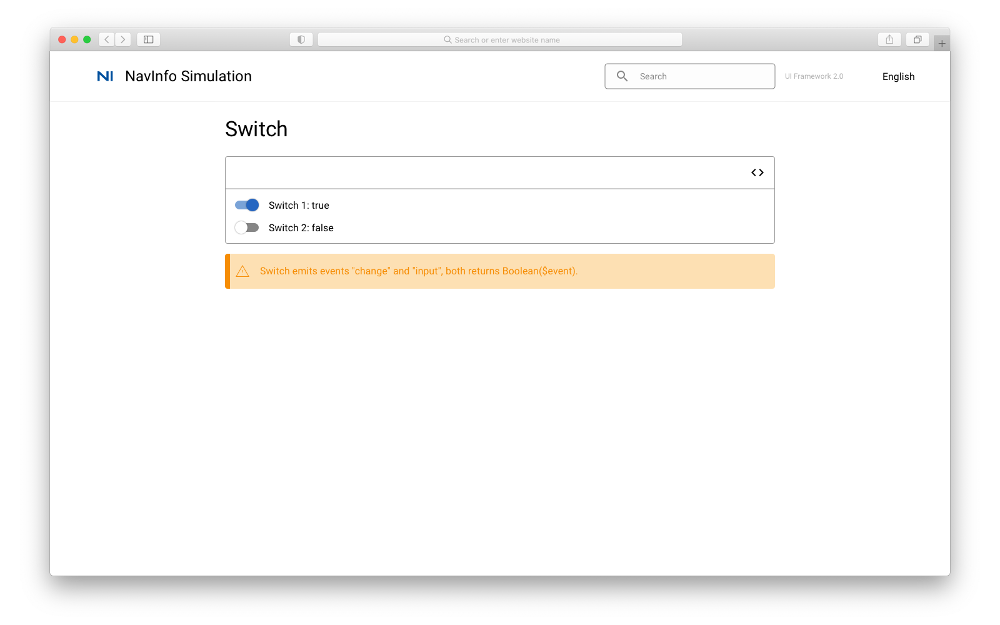
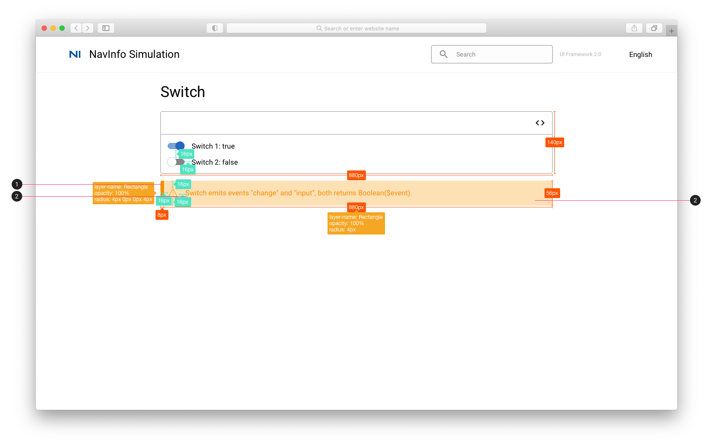

# Switch 开关

## Switch

## Switch 标注

1. 提示框标签颜色：#F68D05
2. 提示框颜色：#FDE0B3
3. 提示文字：Body 1 #F68D05
4. [提示](../../../icon_library/alert_event.svg)

## 参考资料

* Vuetify: [Vuetify Switch](https://vuetifyjs.com/en/components/switches/)

