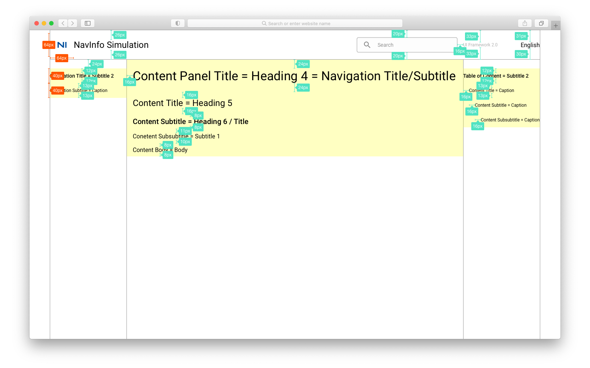

# 整体说明 General

## 布局类型

仿真产品使用 2 类布局。

1. 任务型产品，使用`12 栅格`的布局。包括：
    * `前端框架`：UI Framework
    * `仿真平台`：NI Simulation - Simulation Tasks
    * `仿真平台`：NI Simulation - Simulation Statics
2. 工具型产品，使用`0 栅格`的布局。包括：
    * `仿真平台`：NI Simulation - Simulation Analyzer
    * *`内部工具`：Scenario Cloning - Scenario Visualizer（暂缓）*

## 响应式布局

* NavInfo Simulation 正式版（第一版），不使用响应式布局。
    * 只做桌面版网页的默认布局。
    * 暂时不做移动端的布局。
* UI Framework，预研响应式布局。
    * 研发优先做 12 栅格。
    * 产品设计做移动端布局设计。

### 12 栅格

#### 默认 (W = 1440)

#### 大屏 (W > 1440)

#### 移动端 (W < 1440)

1. 横向滚动条

### 0 栅格 (内容向四边对齐)

#### 默认 (W = 1440)

#### 大屏 (W > 1440)

#### 移动端 (W < 1440)

横向滚动条

## 界面宽度说明

### 12 栅格

1. margin width = 56
2. column width = 88
3. gutter width = 16
4. default
    * page width = 1440
    * columns = 12

### 0 栅格

1. 顶部、底部固定。
2. 与顶部、底部、侧边的距离/间距固定。

## 界面内容说明

### 前端框架 (UI Framework)

#### 内容块

1. Logo & Navigation Menu & Search
    * 位置/效果：固定
    * W = 1328
    * H = 80
2. Navigation
    * 位置/效果：单独纵向滚动条
    * W = 208
    * H = 40
    * Align = left, middle
    * Padding = 0
3. Content Panel
    * 位置/效果：页面纵向滚动条
    * W = 912
    * H = 40
    * Padding = 16 (左右都)
4. Table of Content
    * 位置/效果：单独纵向滚动条
    * W = 208
    * H = 40
    * Align = left, middle
    * Padding = 0
5. Padding (Content Panel)
    * 内容面板，左右 padding = 16

#### 文字

根据 UI Framework 的 Typography。

##### 大小

1. 产品名称 = Heading 5
2. 搜索框内文字 = Body 2 （颜色有变化）
3. 产品版本 = Comments
4. 语言切换 = Body 1
5. 间距 = 24
6. 导航栏标题 = Subtitle 2
7. 导航栏子标题 = Caption
8. 内容页标题 = 导航栏标题/子标题 = Heading 4
9. 内容标题 = 目录标题 = Heading 5
10. 内容子标题 = 目录子标题 = Heading 6
11. 内容子子标题 = 目录子子标题 = Subtitle 1
12. 内容文字 = Body
13. 目录标题 = “Table of Conetent” = Subtitle 2
14. 目录 = Caption
    * 子目录和上级目录左侧间距 = 16

##### 间距

##### 颜色

根据 UI Framework 的 Color。

1. 鼠标点击当前页面 = Navigation 选中 = Primary Color = #004F9D
2. 鼠标悬停于文字 = 文字高亮 = Primary Color = #004F9D
3. 页面向上滚动 = Table of Content 内容置灰 = Secondary Color = #CECECE
4. 页面当前 = Table of Content 高亮 = Primary Color = #004F9D
5. 页面未到达 = Table of Content 常规颜色 = #000000
6. 顶部导航栏阴影效果
    * box-shadow - 底部阴影
    * 阴影值：x = y = 0；blur = 0.2

### 仿真平台 (NI Simulation)

#### 仿真任务/统计数据

##### 内容块

1. Navigation Menu
    * W = 1328
    * H = 64
2. Buttons / Manipulations
    * W = 1328
    * H = 56
3. Content Panel
4. 栅格
    * 1 列 = 1328
    * 2 列 = 656
    * 3 列 = 432
    * 4 列 = 320
    * 6 列 = 208
    * 12 列 = 96

##### 文字

根据 UI Framework 的 Typography。

#### 场景/仿真可视化

##### 内容块

##### 文字

根据 UI Framework 的 Typography。

## 参考产品

* 平台：[getcue.app](https://getcue.app/)，[Material for MkDocs](https://squidfunk.github.io/mkdocs-material/getting-started/)
* 可视化：[webviz.io](https://webviz.io/app/?demo)