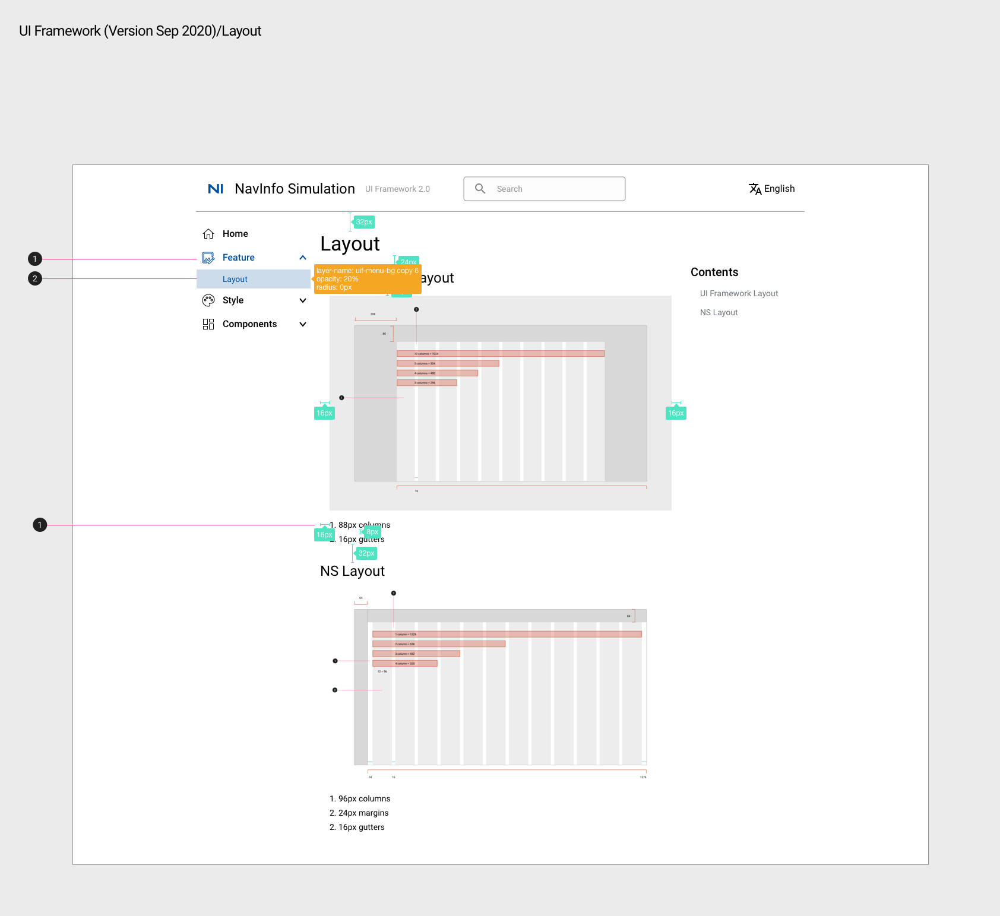
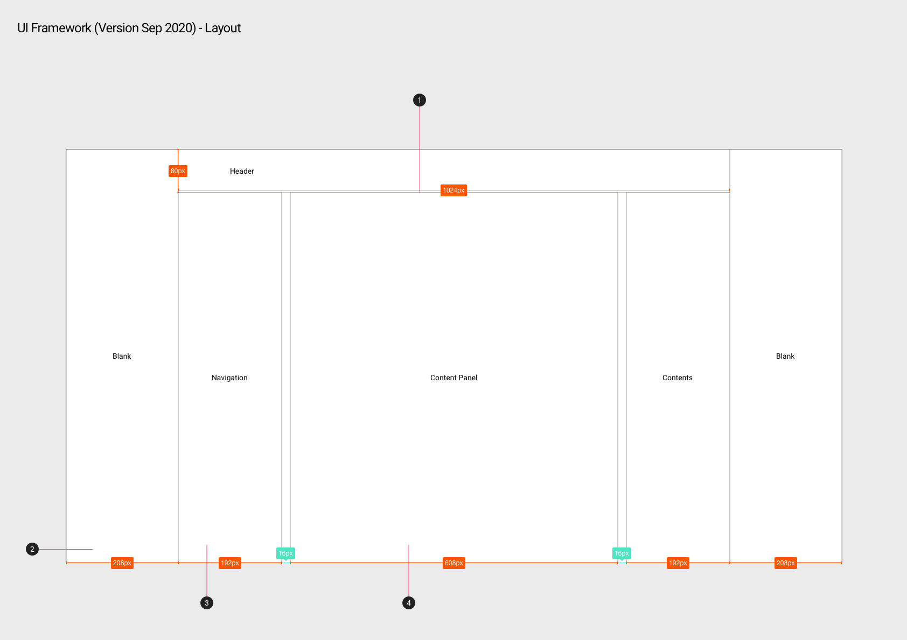
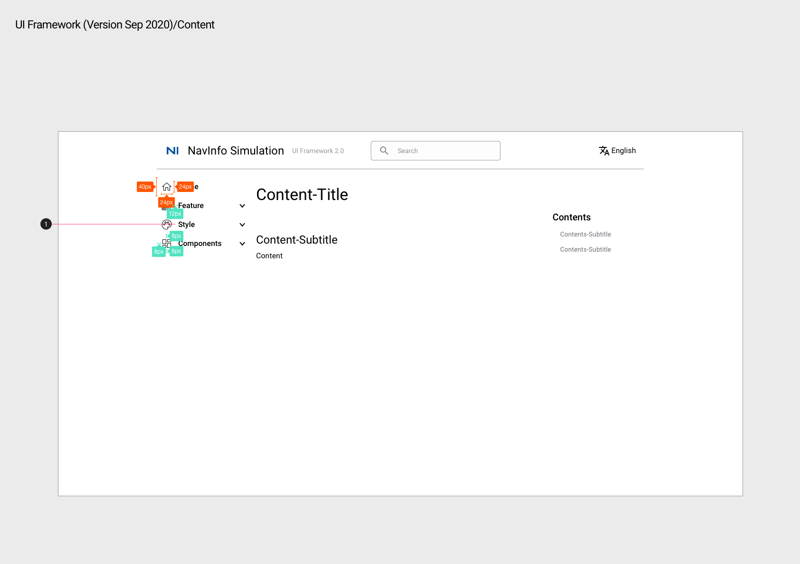
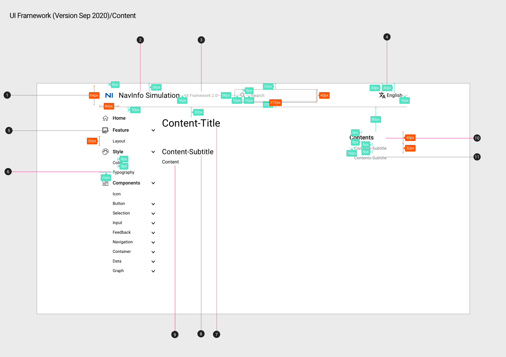
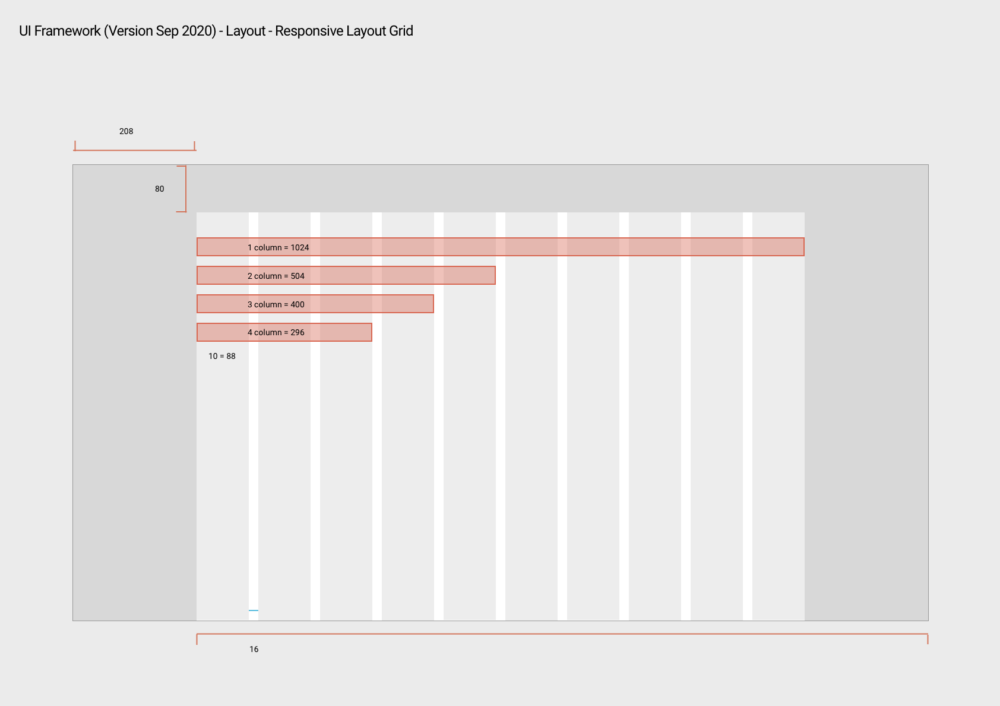

# Layout 布局

## UI Framework Layout

1. 一级标题下的二级标题被选中时，一级标题图标及字体均变为主色 #004F9D
2. 二级标题选中状态：图标和文字全部变为 primary color #004F9D,  矩形框填充色也为注册，透明度20%
3. 字体：body 2

### UI Framework 页面排布

1. 页面居中显示内容宽为1024px
2. 两侧留白为208px（当页面宽幅为1440px时）
3. 两侧菜单栏宽均为192px，左侧显示一级标题，二级标题...，右侧菜单栏显示最末级标题下的子标题
4. 中间内容显示宽为608px，并与两侧菜单栏相距16px

### UI Framework 目录

#### UI Framework 一级目录

1. 一级标题字体：Roboto Medium 16px

#### UI Framework 二级目录及右侧页面目录

1. NI图标：64px * 64px
2. NavInfo Simulation：Heading 5， 紧靠NI图标
3. UI Framwork2.0：Roboto  Regular 14px #979797
4. English: Body1, 翻译图标右侧紧靠English
5. 菜单一级标题：Roboto Medium 16px
6. 菜单二级标题：Body 2
7. 内容一级标题：Heading 4
8. 内容二级标题：Heading 5
9. 内容字体：Body 1
10. 目录一级标题：Title
11. 目录二级标题：Body 2 #6D7278

### UI Framework 响应式布局

10 column（每个column 88px）， gutter（16px），margin（0）

## NS Layout