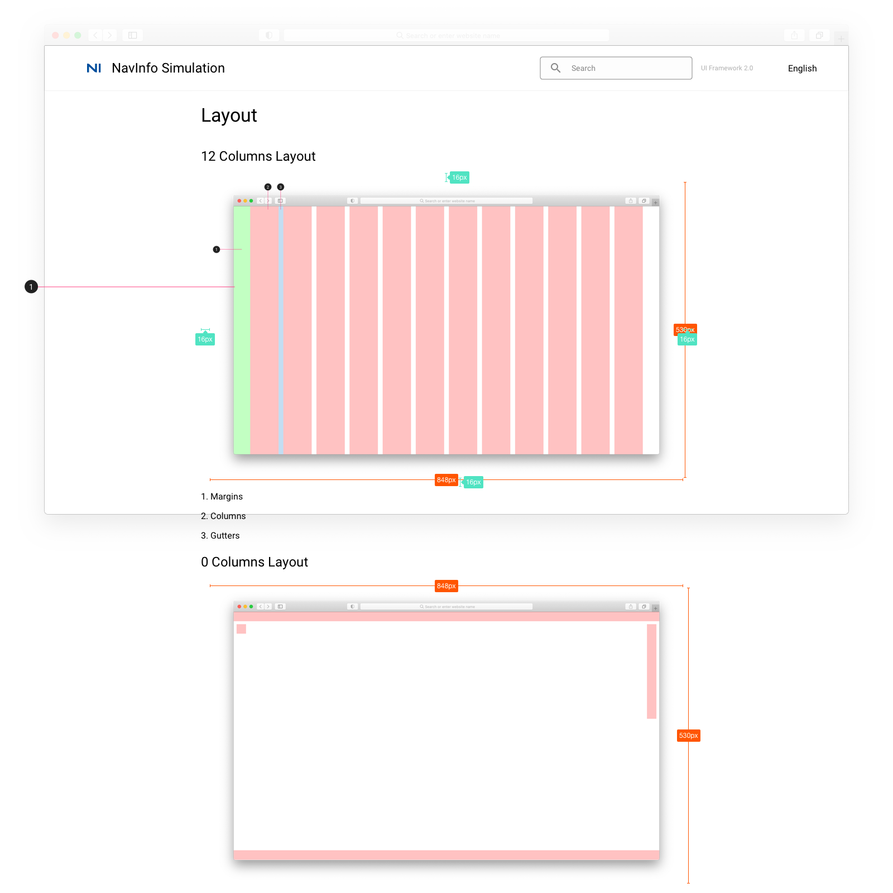

# Layout 布局

## UI Framework Layout

## UI Framework Layout 标注

1. 图片 padding =16
2. [12栅格图片](../../imgs/ns_ui_framework_measure/feature/12columns.png), [0栅格图片](../../imgs/ns_ui_framework_measure/feature/0columns.png)