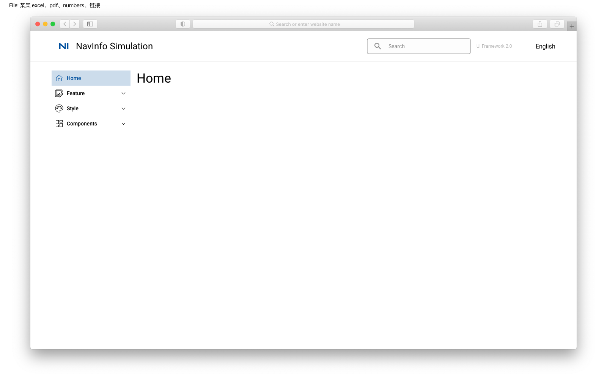
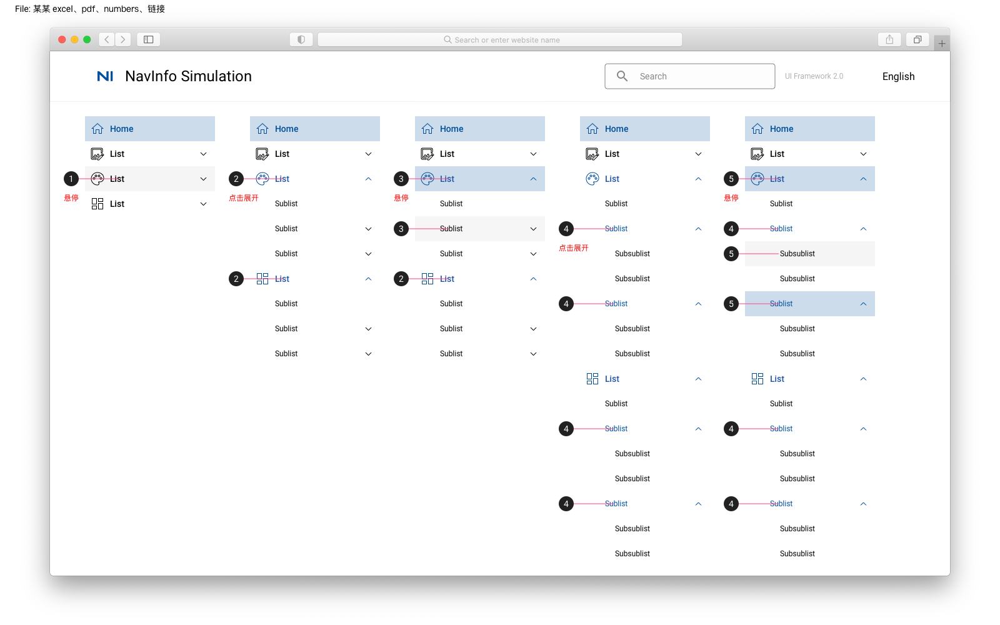
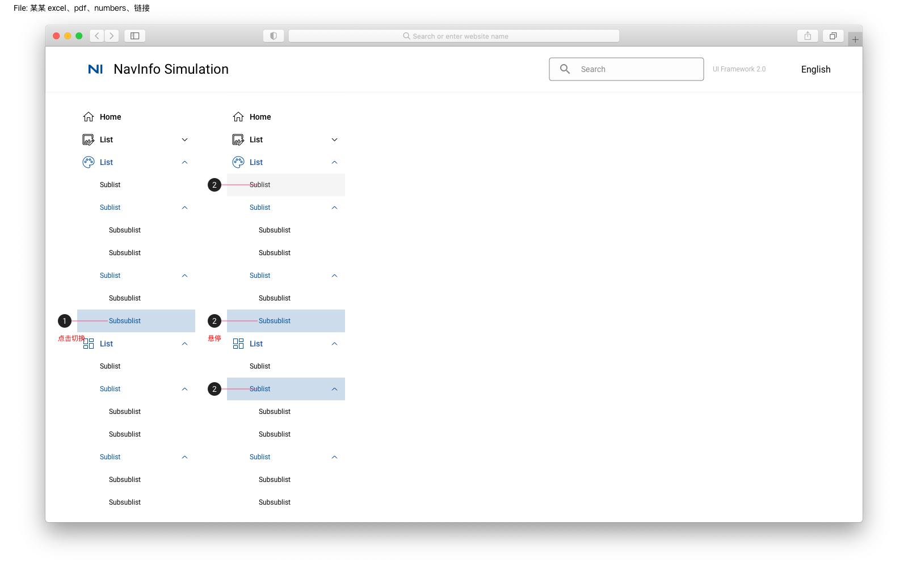

# Interactive Instructions 交互说明

## Initial 初始状态

## Mouse Hover Click 鼠标悬停点击

1. 鼠标悬停在未激活的标题，背景色变灰
2. 鼠标点击展开标题，图标，文字，展开符号高亮；列表展开后其他展开项不缩回
3. 鼠标悬停在展开项，背景色高亮
4. 鼠标点击展开次级标题，文字，展开符号高亮；次级标题列表展开后其他展开项不缩回
5. 鼠标悬停在次级标题展开项，背景色高亮
6. 鼠标悬停在未激活的最次级标题标题，背景色变灰

## Change Page

1. 鼠标点击选中并激活最末级标题，文字，背景高亮
2. 鼠标悬停在未激活的最末级标题，背景色变灰；鼠标悬停在选中的最末级标题，文字，背景高亮；鼠标悬停在激活的次级标题，背景高亮