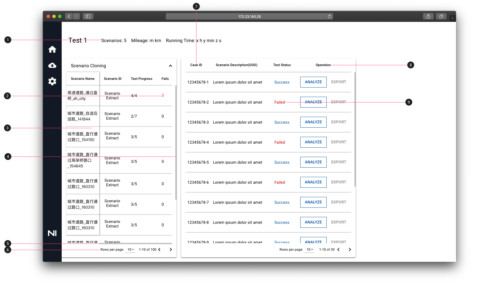
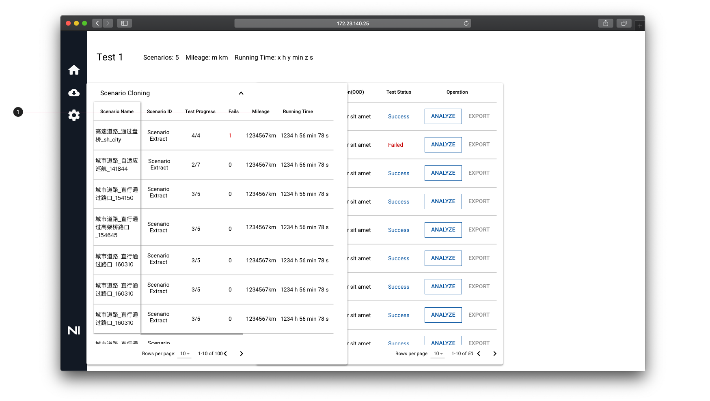

# Scenario Test Monitor 功能

1. 统计所有场景测试的总里程和运行时间
2. Fails数：一个场景的Fails数等于该场景内所有case Fail的次数之和
3. 表格第一列固定
4. 表格最大高度为 695px。若表格高度小于695px，则表格高度随内容行数动态变化；若表格高度大于695px，则表格高度固定不变，上下滑动表格时，右侧出现滚动条。
5. 通过左右滑动滚动条，观看未展示的内容
6. 分页栏：每页表格最多显示10行表格
7. Scenario ID 改为 Case ID
8. 添加 Option 标题，Option 下的表格内每行都包含 ANALYZE 和 EXPORT 按钮
9. Failed 用红色字体表示

1. 表格展开全部内容：记录每个场景测试的里程和运行时间