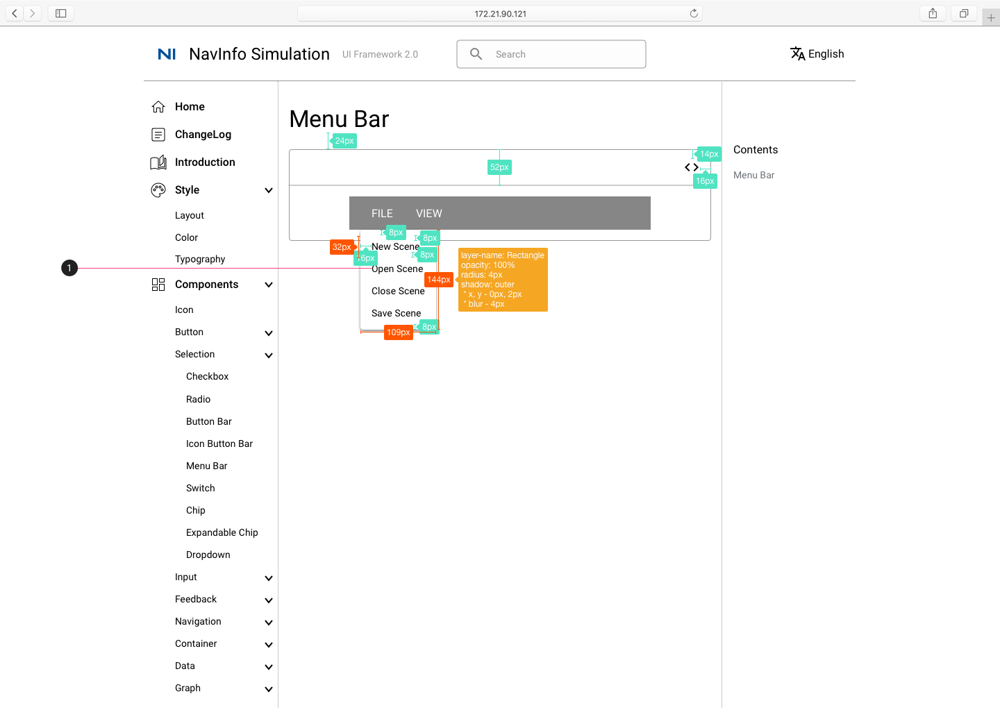
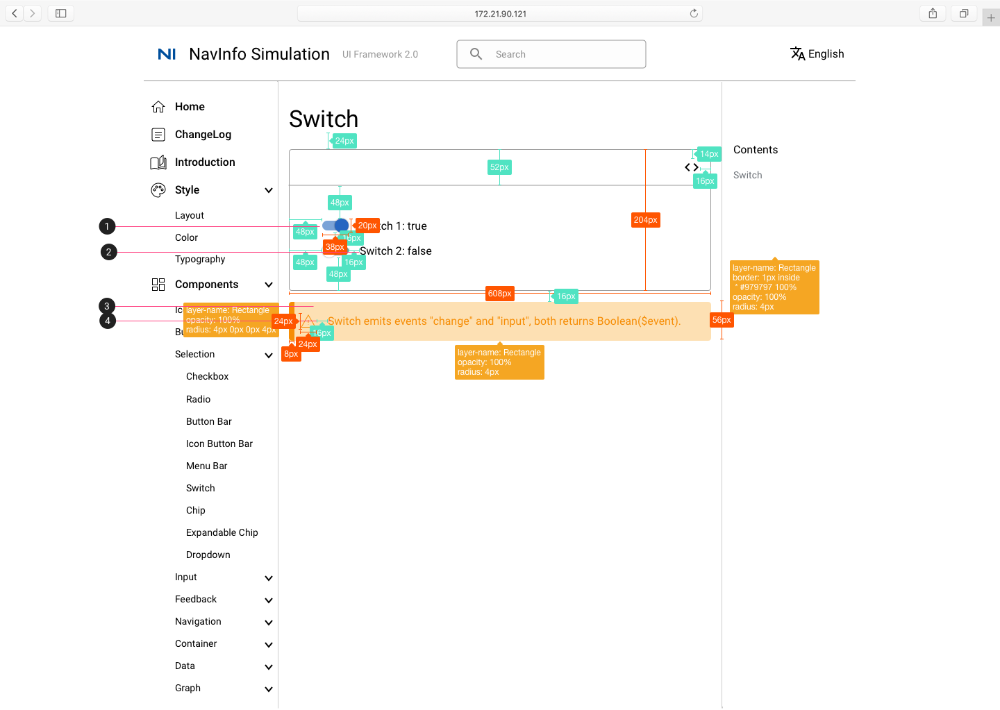
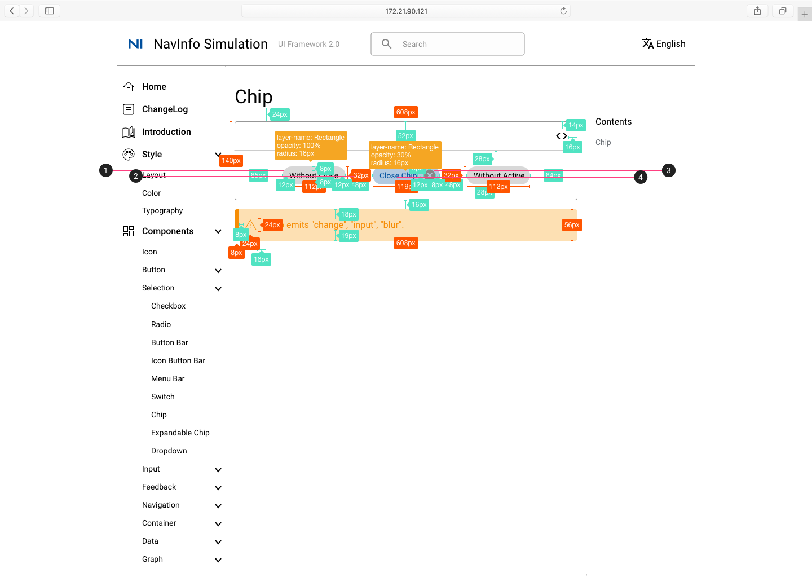

# 选择器 Selection

## Checkbox 多选

1. 选项字体：Body 1
2. 选中状态，颜色为#004F9D

## Ratio 单选

1. 选项字体：Body 1
2. 选中状态，颜色为#004F9D
3. 禁用状态，颜色为#868686

## Button Bar

1. Button Bar 字体：Button #868686

## Icon Button Bar

1. 字体：Body 1

## Menu Bar

1. 填充颜色：#868686
2. 字体：Body 1 #FFFFFF

1. 点击FILE，出现选项框，选项框内字体：Body 2

1. 点击VIEW，出现选项框，选项框内字体：Body 2

## Switch

1. Switch 组件，蓝色为开，灰色为关
2. 字体：Body 1
3. 圆角矩形颜色：#FDE0B3
4. 右侧矩形颜色：#F68D05

## Chip

1. 圆角矩形颜色：#868686
2. 字体：Body 2
3. 圆角矩形颜色：#BAE2FF
4. 字体：Body 2 #004F9D

点击close按钮后，原chip消失，剩余chip居中

## Expandable Chip

1. Clip Title: 字体Body 2

1. 点击Clip Title 显示内容：字体Body 2

## Dropdown

1. 字体：Body 2

### Dropdown Basic

1. 字体：Body 2

1. 字体：Body 2
2. 字体：Body 2 #868686

